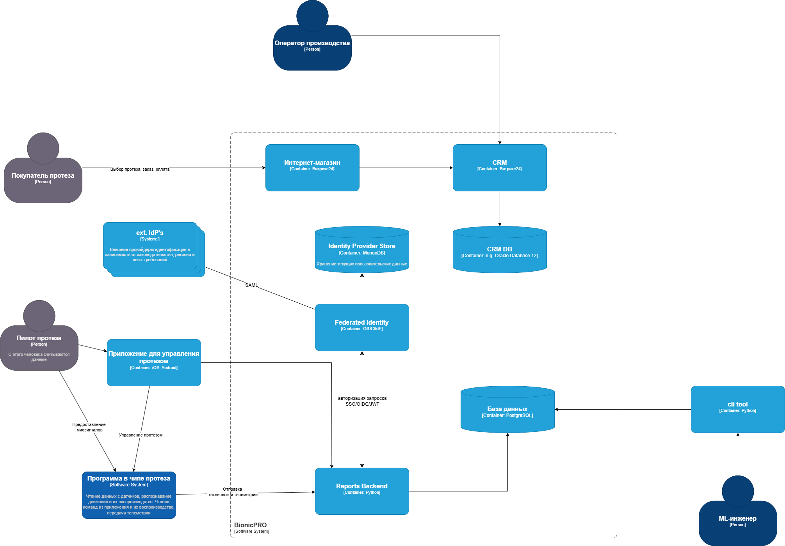
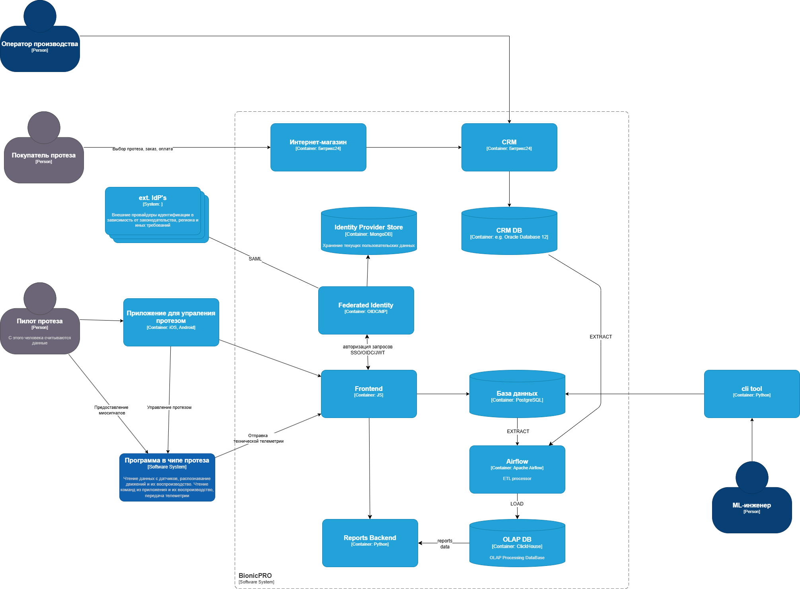
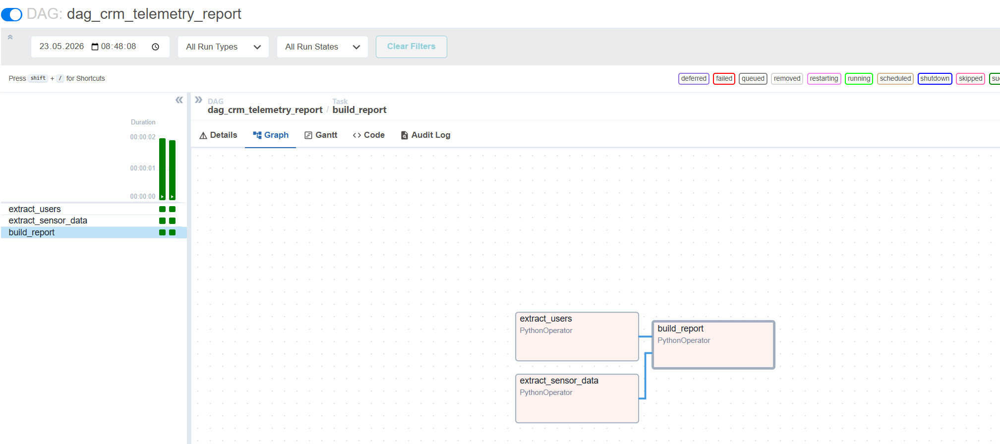
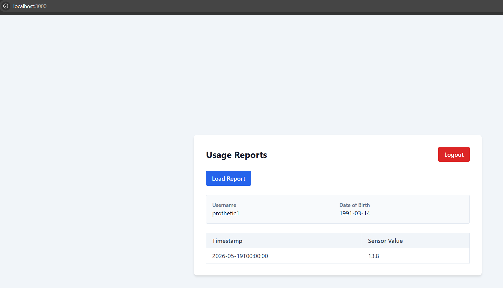
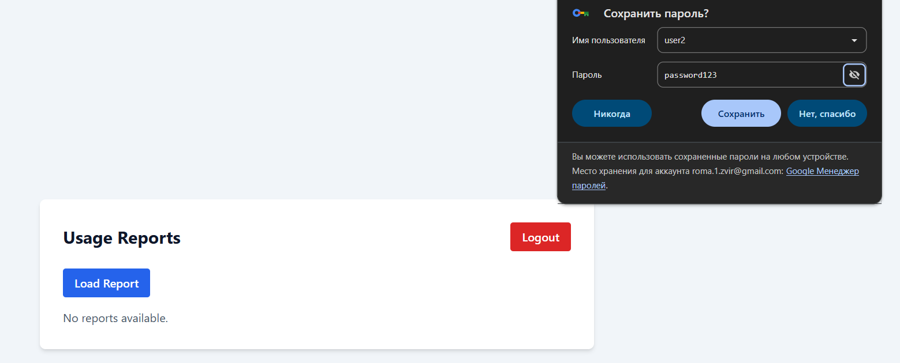

# architecture-bionicpro


## Схема решения для управления учётными данными пользователя




## Схема решения для подготовки и получения отчётов




# Краткая инструкция

## Что входит в проект

- `frontend` - React-приложение на `http://localhost:3000`.
- `backend` - FastAPI API на `http://localhost:8000`.
- `keycloak` - авторизация пользователей на `http://localhost:8080`.
- `airflow-webserver` - Airflow UI на `http://localhost:8081`.
- `postgres` - общий PostgreSQL-контейнер с базами `crm`, `telemetry`, `olap` и метаданными Airflow.

OLAP-таблица `report` находится в PostgreSQL-базе `olap`.

## Запуск

```powershell
docker compose up -d --build
```

Проверить состояние контейнеров:

```powershell
docker compose ps
```

## Подготовка отчета

После первого запуска нужно выполнить Airflow DAG, который перенесет данные из `crm` и `telemetry` в `olap.report`.

Через командную строку:

```powershell
docker compose exec airflow-scheduler airflow dags trigger dag_crm_telemetry_report
```

Или через Airflow UI:

1. Открыть `http://localhost:8081`.
2. Войти: `admin` / `admin`.
3. Найти DAG `dag_crm_telemetry_report`.
4. Запустить DAG вручную.

## Получение отчета во frontend

1. Открыть `http://localhost:3000`.
2. Войти через Keycloak пользователем, для которого есть данные:

| Логин | Пароль |
| --- | --- |
| `prothetic1` | `prothetic123` |
| `prothetic2` | `prothetic123` |
| `prothetic3` | `prothetic123` |

3. Нажать `Load Report`.

Backend возвращает только строки, где `report.username` совпадает с `preferred_username` из Keycloak-токена. Поэтому пользователи `user1`, `user2` и `admin1` могут успешно войти, но отчет для них будет пустым.

## Полезные проверки

Посмотреть строки в итоговой OLAP-таблице:

```powershell
docker compose exec -T postgres psql -U airflow -d olap -c "SELECT * FROM report ORDER BY username, timestamp;"
```

Проверить последние запуски DAG:

```powershell
docker compose exec -T airflow-scheduler airflow dags list-runs -d dag_crm_telemetry_report --no-backfill
```

Остановить проект:

```powershell
docker compose down
```

Если нужно полностью пересоздать базы и применить `airflow/db/init-db.sql` заново:

```powershell
docker compose down -v
docker compose up -d --build
```


## Успешная отработка DAG


## Успешно получил отчет под пользователем с нужными правами


## Ошибка при получении отчета под


